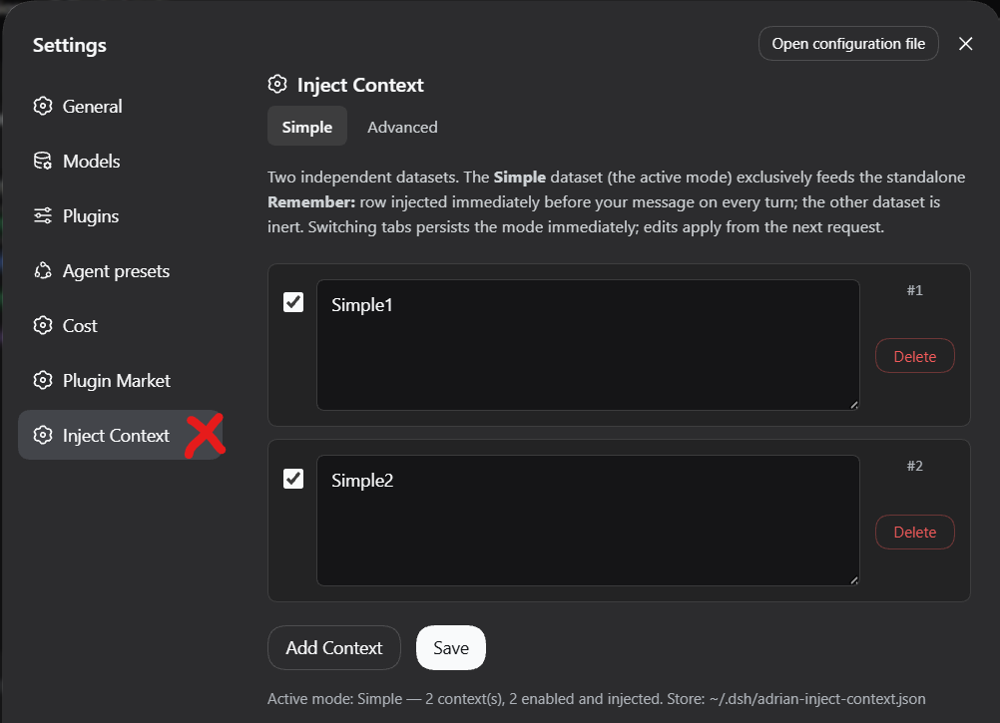
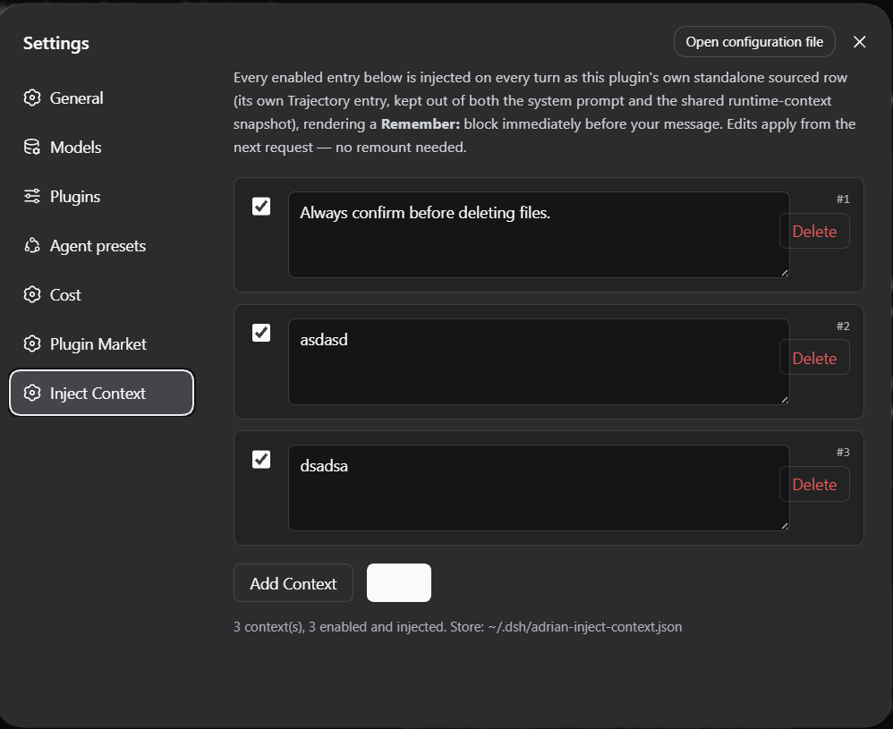

# dsh-adrian-inject-context

Inject Context for [DeepSeek Harness (DSH)](https://github.com/deepseek-ai/deepseek-harness): persist your own context entries and have them injected as a standalone **Remember:** row — right after the system prompt, before your message — on every turn or once per session, per entry.

## Features

- **Standalone sourced row** — never touches the initial system prompt or the shared runtime-context snapshot
- **Simple / Advanced datasets** — two independent context lists; the active mode's dataset is what gets injected (exclusive)
- **Per-entry checkboxes** — toggle any entry on/off, applies from the next request
- **Per-entry frequency (v0.3.0)** — each entry has an **Every turn** switch: ticked (default) the entry is injected before every turn; unticked it is injected only at the start of a session and never again — restart-safe, detected from the session's persisted sourced-message surface plus in-memory per-session tracking
- **Native Settings UI** — Settings → Inject Context: add, edit, delete, toggle, save
- **Persistent** — datasets and active mode survive sessions and restarts
- **Standalone manager page** — also available at `/adrian-inject-context`

## Screenshots

**Settings → Inject Context — manage your datasets**



**Remember: row in the Trajectory**



## Install

```sh
dsh plugin --profile web add polohot/dsh-adrian-inject-context
```

## Usage

1. Open **Settings → Inject Context**
2. Add context entries; per row, two switches:
   - **Enabled** — off = never injected
   - **Every turn** (ticked by default) — ticked = injected before every message; unticked = only the first message of a session
3. Pick the active tab (**Simple**/**Advanced**) — its dataset feeds the injection
4. Send any message and check the **Trajectory**: your `Remember:` block sits between SYSTEM and your message

### Per-entry frequency (v0.3.0)

| Enabled | Every turn | Behavior |
| --- | --- | --- |
| off | — | never injected |
| on | ticked | injected before **every** turn of every session (the default, and the migration default for existing entries) |
| on | unticked | injected only at the **start of a session** (its first turn), never again in that session |

Once-per-session entries are **restart-safe**: a process restart never re-injects a once-entry into a session that already carries it. Prior injection is detected from the session's persisted sourced-message surface (the `adrian-inject-context:lessons` rows) plus in-memory per-session tracking while the process lives. Unticking an entry mid-session lets it appear on the next message exactly once more, then never again — per dataset, so Simple and Advanced stay fully independent.

## Configuration

Store: `~/.dsh/adrian-inject-context.json` (schema v2, auto-migrated from v1):

```json
{
  "version": 2,
  "mode": "simple",
  "simple":   { "lessons": [{ "id": 1, "text": "…", "enabled": true, "everyTurn": true }] },
  "advanced": { "lessons": [] }
}
```

`everyTurn` was added in v0.3.0 without a schema bump — entries missing the field default to `true` (the previous every-turn behavior).

## Requirements

- DeepSeek Harness `dsh` ≥ 0.1.2-rc.1 (tested on web profile)

## How it works

Host-side: an `agent/pre-step` waterfall listener composes the block per step — all enabled every-turn entries plus enabled once-entries not yet delivered to that session — and prepends the plugin's own independently-sourced user-role message (the same pattern as `dsh-agent-instructions`), freshly read from the store on every step. It never injects into an empty entering batch (the agent loop's turn-close signal). Client-side: a settings-section module renders the manager against two host routes. Zero system-prompt modification.

## License

MIT
